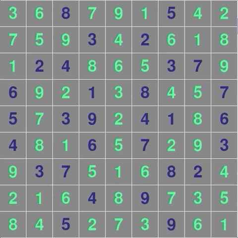

# SUDOKU_solver_python
Simple sudoku solver in Python using a backtracking algorithm.




- To input a number select the desired cell with LMB and press the number on your keyboard.
- To clear the selected cell press ESC.
- To start solving press RETURN.

- You can also use file input. When running the program specify the name of your file: `python3 sudoku.py input.txt`.
- Input format (zeros represent empty spaces):
```
 0 0 8 0 0 0 5 0 0 
 0 0 0 3 0 2 0 0 0
 0 2 4 0 0 0 3 7 0
 6 0 0 1 0 8 0 0 7 
 5 0 3 9 0 4 1 0 6
 4 0 0 6 0 7 0 0 3
 0 3 7 0 0 0 8 2 0
 0 0 0 4 0 9 0 0 0
 0 0 5 0 0 0 9 0 0
```

Keep in mind, that the main goal of this program is to show how a backtracking algorithm works, it is certainly not about quick sudoku solving.